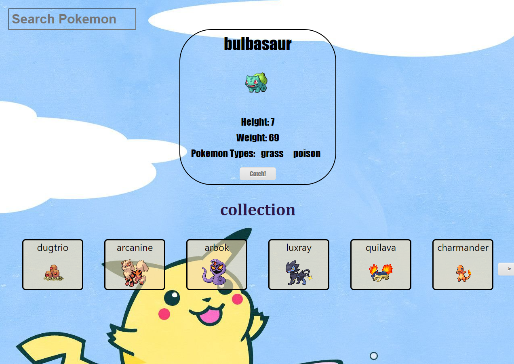

# Pokedex Task ! 

 
## [Demonstration](https://youtu.be/e2UCxPgjDpc)

# Introduction

This is a Pokedex we built on React

## Usage

Simply visit [this page](https://whispering-spire-37038.herokuapp.com/), and get CATCHING!

## Usage: Features

* Is responsive.
* Catch and collect Pokemon!
* View various Pokemon stats.
* Search Pokemon by name.
* Random Pokemon every time you enter the site!
* Slick design with more to come.

## Contributing
Pull requests are welcome. For major changes, please open an issue first to discuss what you would like to change.
Please make sure to update tests as appropriate.

## Current Contributors and credits
Yuval Nakav, Koren BE

## License
Cyber4s, 2021
